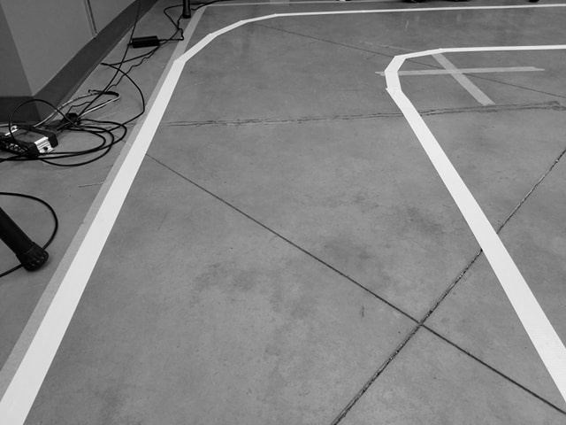
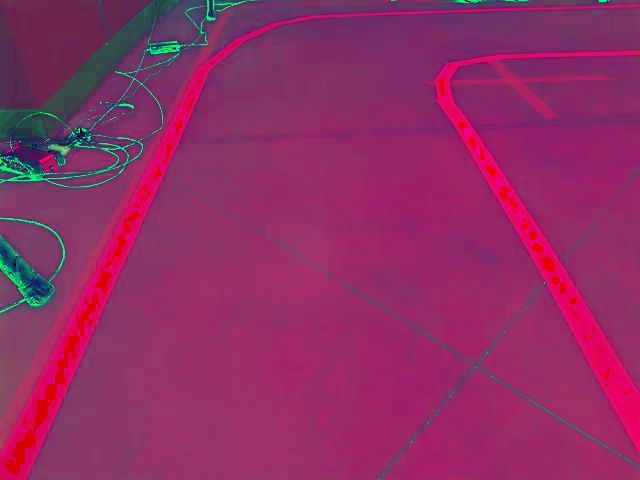
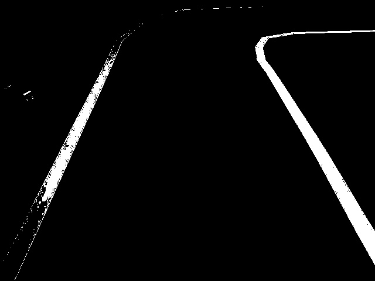
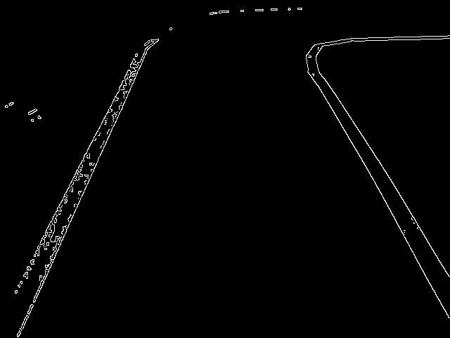
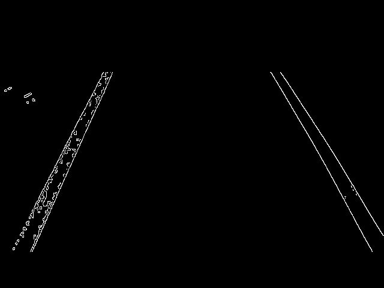
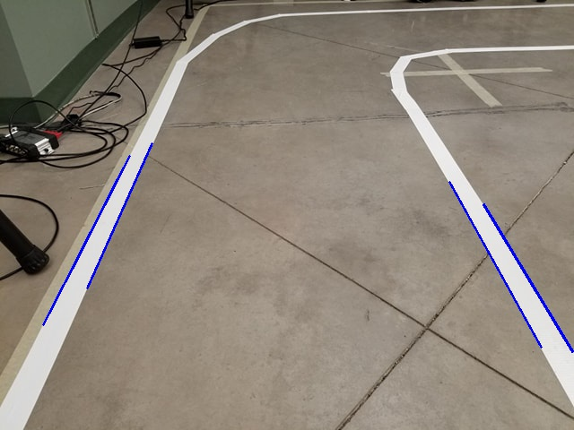

# Lane-Detection

## Steps
* Convert to Grayscale
* Convert to HSV
* Segment Based on lane color (white/yellow)
* Gaussian Filter
* Apply Morphological filter (if needed)
* Canny Edge Detection
* ROI for road only
* Hough Lines
## Steps Visualization 

## Acknowledgement 
* UoA CMPUT 412 line following competition 
* Udacity Self Driving Car Course 
